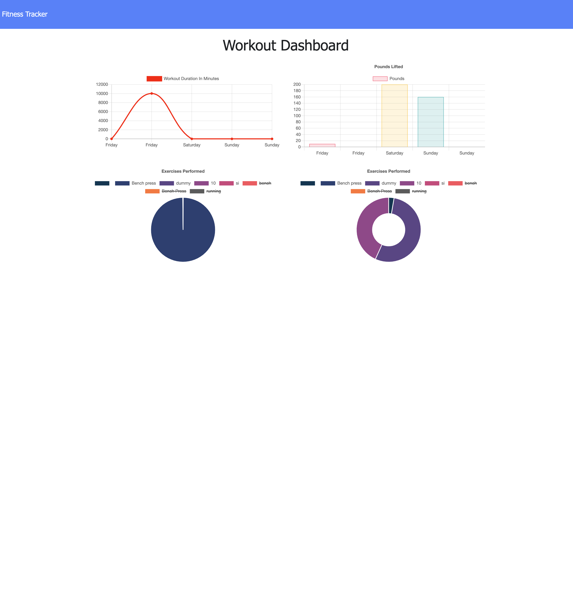

# WorkoutTraker

* [Installation](#installation)
* [Usage](#usage)
* [Credits](#credits)
* [License](#license)
# Installation
This application requires Node.js . It utilizes the folowing node modules mongoose, dotenv, express, morgan and can be installed using node package manager. This app utilizes a mongoDB database either locally or server based.
## Usage
create or continue your exercises in the main screen, and track them on the dashboard page.
### instructions 
The user can track their exercises in the app and it will display a breakdown of the workout information on the dashboard page in a chart.

## Credits
Open source project.
## License 
N/A

# Contact
* GitHub :japb1998
* Linkedin :japb1998
* E-mail :japb1998@gmail.com